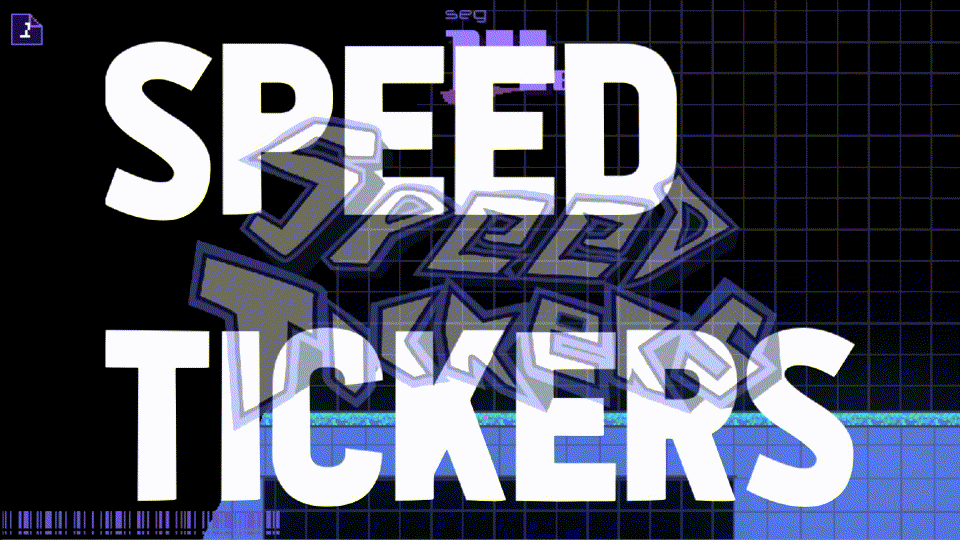

# SPEEDTICKERS

Speedtickers is a fast paced speedrun centered 2d platformer game that uses the momentum based physics and fast movement from Ultrakill.

Original prototype submited for [Hackclub Juice Gamejam](https://github.com/hackclub/juice), with special mentions from Santa Fe Argentinian province, and nominated with Hackclub White Rabbit.

[Check my blog made about it!](https://juanest.dev/Shanghai/)
## Issues
if you find any bug or think that a feature should be implemented to the game, you can file a issue.

## Authors
Coding, game design, sounds, and art of the game was made by [@juanes10201](https://github.com/juanes10201)
Music was made by Agustin Barrios

## Credits
[Kenney Input Prompt Pixel](https://www.kenney.nl/assets/input-prompts-pixel-16) was used for the controller button icons

[Hyohnoo Keyboard Controller keys](https://hyohnoo.itch.io/keyboard-controller-keys) was used for the keyboard button icons

[Holographic Card Shader](https://godotshaders.com/shader/2d-holographic-card-shader/)Used for the player icon in the Level Select menu

[Rotation Displacement Vertex Shader](https://godotshaders.com/shader/rotation-displacement-vertex-shader/) Used for the Player name in the Level Select menu

If i missed any asset that i used for the game send a pr or send me [an email](juanesteban10201@gmail.com)

## License
The source code and official binaries are distributed under [End-User License Agreement for Speedtickers](https://github.com/juanes10201/speedtickers/blob/main/EULA.txt)
