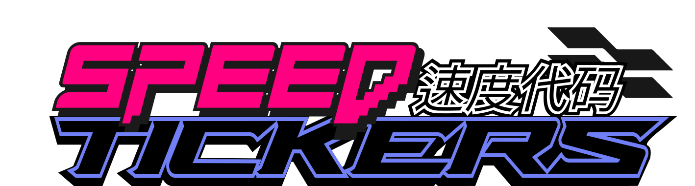
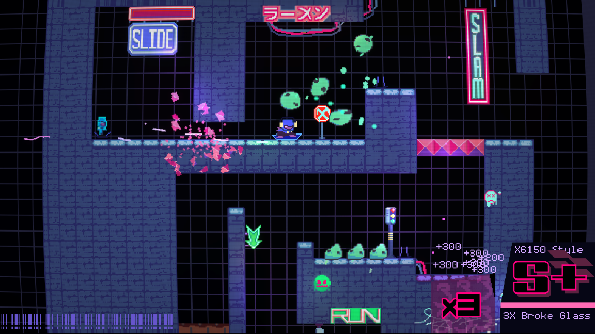

# SPEEDTICKERS



[](https://juanes10201.itch.io/speedtickers)

Speedtickers is a fast paced speedrun centered 2d platformer game that uses the momentum based physics and fast movement from Ultrakill. Built with **Godot 4**.

Original prototype submited for [Hackclub Juice Gamejam](https://github.com/hackclub/juice).

[Check my blog about juice!](https://juanest.dev/Shanghai/)

## Requirements

- [Godot Engine 4.x](https://godotengine.org/download) (Currently using Godot 4.6 Stable)

## How to Download

1. Click the green **Code** button on this repository's GitHub page.
2. Select **Download ZIP**, then extract it to a folder on your computer.

   Or, if you have Git installed, clone it via terminal:
   ```bash
   git clone https://github.com/juanes10201/UntitledPlatformer.git
   ```

## How to Open the Project

1. Open **Godot Engine 4**.
2. In the Project Manager window, click **Import**.
3. Click **Browse**, navigate to the folder where you downloaded/cloned the repo, and select the `project.godot` file located in the root folder.
4. Click **Import & Edit** to open the project in the Godot editor.

## How to Debug the Game

- Once the project is open in Godot, press **F5** (or click the Play button in the top-right corner) to run the game.

## How to Export the Game

1. In the Godot editor, go to **Project > Export**
2. Click **Add** and choose the platform you want to export to (Windows, Linux, macOS, Web, etc.).
3. If it's your first time exporting for that platform, Godot may ask you to download the corresponding **export templates**. You can do this from **Editor > Manage Export Templates**, then click **Download and Install**.
4. Configure the export settings for your chosen platform (icon, name, resolution, etc.) as needed.
5. Click **Export Project**, choose a destination folder, and give the executable a name.
6. Once exporting finishes, you'll find the runnable game file (`.exe`, `.x86_64`, `.app`, etc.) in the folder you selected.

## Issues
Feel free to open an issue or submit a pull request if you'd like to contribute.

## Authors
Coding, game design, sounds, and art of the game was made by [@juanes10201](https://github.com/juanes10201)
Music was made by Agustin Barrios

## Credits
[Kenney Input Prompt Pixel](https://www.kenney.nl/assets/input-prompts-pixel-16) was used for the controller button icons

[Hyohnoo Keyboard Controller keys](https://hyohnoo.itch.io/keyboard-controller-keys) was used for the keyboard button icons

[Holographic Card Shader](https://godotshaders.com/shader/2d-holographic-card-shader/)Used for the player icon in the Level Select menu

[Rotation Displacement Vertex Shader](https://godotshaders.com/shader/rotation-displacement-vertex-shader/) Used for the Player name in the Level Select menu

If i missed any asset that i used for the game send a pr or send me [an email](juanesteban10201@gmail.com)

## License
The source code and official binaries are distributed under [End-User License Agreement for Speedtickers](https://github.com/juanes10201/speedtickers/blob/main/EULA.txt)
